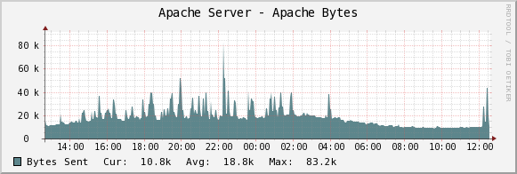
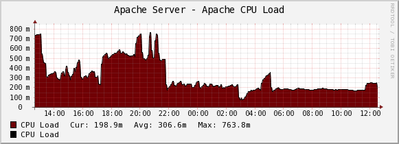
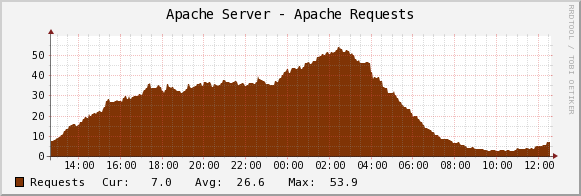
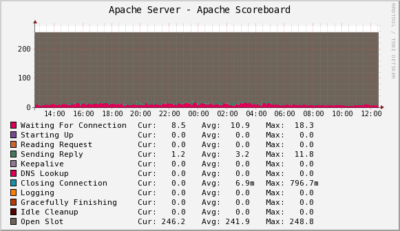
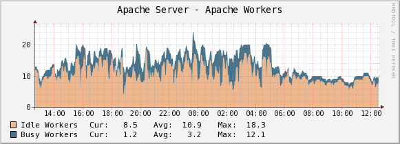

.. _cacti_apache_graphs:

Apache Graphs
=============

These templates use ``ss_get_by_ssh.php`` to connect to a server via SSH and
extract statistics from the Apache server running there, by executing the
``wget`` program with the url ``/server-status``.  This means you don't need to
install any special tools.  Standard Unix command-line tools are all you need.

Installation
============

Once the :ref:`cacti_ssh_setup` is working, `configure Apache to report its
status <http://httpd.apache.org/docs/2.0/mod/mod_status.html>`.  The typical
setup is to enable status for 127.0.0.1 at the URL ``/server-status``. If you
decide to use a different URL, you'll have to configure that in the script
configuration (covered in the general install guide) or pass a command-line
option (also covered in the general install guide).

Be sure to configure Apache with the ``ExtendedStatus On`` directive so you get
full status.

Finally, test one of your hosts like this.  You may need to change some of the
example values below, such as the cacti username and the hostname you're
connecting to.

``# su - cacti -c 'env -i php /var/www/cacti/scripts/ss_get_by_ssh.php --type apache --host 127.0.0.1 --items ge,gf'``

Sample Graphs
=============

The following sample graphs demonstrate how the data collected from Apache is
presented.

   The number of bytes sent by Apache.

   Apache's CPU usage.

   The number of requests that Apache has handled.

   The number of Apache processes in each of a variety of statuses.

   
   The number of worker processes busy or idle at any given time.
