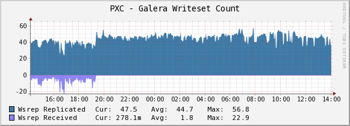
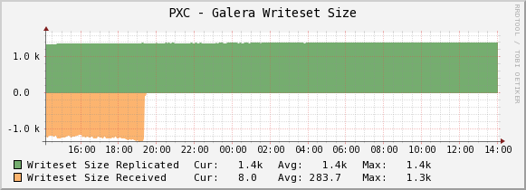
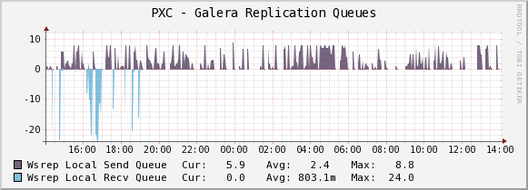
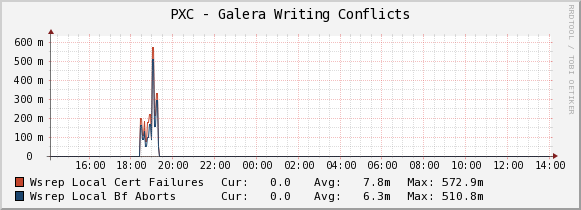
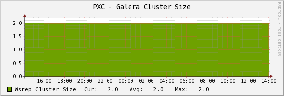
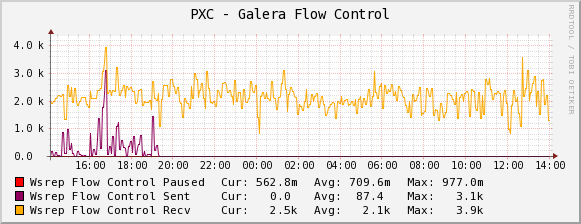

.. _cacti_galera_templates:

Percona Galera/MySQL Monitoring Template for Cacti
==================================================

Galera/MySQL is synchronous multi-master cluster for InnoDB databases.
Please refer to :ref:`MySQL Monitoring Template <cacti_mysql_templates>`
for installation intructions.

Sample Graphs
-------------

The following sample graphs demonstrate how the data is presented.

.. image:: images/galera_writeset_traffic.png

Galera Writeset Traffic. This graph shows the bytes of data replicated to the cluster (from this node)
and received from the cluster (any other node).

Galera Writeset Count. This graph shows the count of transactions replicated to the cluster (from this node)
and received from cluster (any other node). 

Galera Writeset Size. This graph shows the average transaction size sent/received.

Galera Replication Queues. The length of send and recv queues.

.. image:: images/galera_parallelization_efficiency.png

Galera Parallelization Efficiency. This graph shows the average distances between highest and lowest seqno
that are concurrently applied, commited and can be possibly applied in parallel (potential degree of parallelization).

Galera Writing Conflicts. This graphs shows the number of local transactions being committed on this node that failed certification
(some other node had a commit that conflicted with ours) -- client received deadlock error on commit and also
the number of local transactions in flight on this node that were aborted because they locked something an applier thread needed
-- deadlock error anywhere in an open transaction. The spike on the graph was created on the time of writing to the same table
potentially the same rows from 2 nodes.

Galera Cluster Size. This graph shows the number of members currently connected to the cluster.

Galera Flow Control. This graph shows the number of FC_PAUSE events sent/received. They are sent by a node when its replication queue
gets too full. If a node is sending out FC messages it indicates the problem. On the graph you can observe FC sent/received when we
were writing to both nodes and once we stopped writing to the current node, FC sent becomes 0 but still receiving FC messages from
the neighbouring node.

IMORTANT NOTE: the Flow Control graph can be faulty until this `bug <https://bugs.launchpad.net/percona-xtradb-cluster/+bug/1180792>`_ is fixed.
The reason is the respective status variables are nullified on every ``SHOW STATUS`` query which means if something else runs it
the Cacti script will see zeros right after that.
