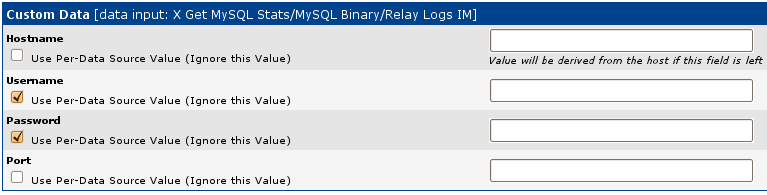
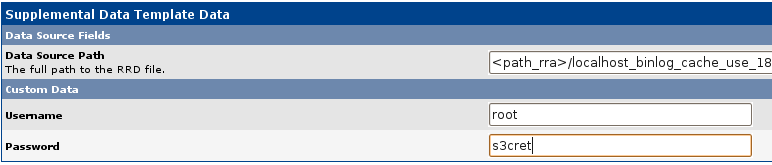

.. _cacti_installing_templates:

Installing Percona Monitoring Plugins for Cacti
===============================================

This page explains how to install and use the pre-built templates that ship with
this project.  If the templates are not exactly what you need, see the
documentation on creating custom templates.

The following instructions assume you have the necessary privileges to make
changes to your Cacti server.  You probably need to become root on that server.

It is a good idea to make sure your Web browser doesn't save your password when
you're using Cacti.  There are some screens in the administrative interface that
have hidden password fields you can't see, but the browser will fill in, and
it'll cause the templates to be configured incorrectly.

Downloading
-----------

You can download the tarball from the `Percona Software Downloads
<http://www.percona.com/downloads/percona-monitoring-plugins/>`_
directory or install the package from `Percona Software Repositories
<http://www.percona.com/software/repositories>`_.

Installing from tarball
-----------------------

You will need to get a copy of the scripts on the server, and you need access to the
templates locally, so you can import them through your web browser.  Therefore,
you should probably download the monitoring plugins to your own computer, and
then upload them to your Cacti server as well.

Let's assume you have just downloaded version 1.0.0, in
percona-monitoring-plugins-1.0.0.tar.gz.  Unpack the archive with the following
command at a command prompt::

   root@cactiserver# tar zxf percona-monitoring-plugins-1.0.0.tar.gz

Repeat the same process on your local computer.  You should now have a directory
containing several files.  (The directory name will change with each new
release).  Change into this directory::

   root@cactiserver# cd percona-monitoring-plugins-1.0.0/cacti/

Before you install, read the specific instructions for the templates you plan to
install.  These are linked from this document's table of contents.

The general process is to copy the data-gathering scripts into place, and then
to import the templates via the web interface.

Copy the PHP scripts into your Cacti installation's scripts directory, on the
server that hosts Cacti.  This is usually ``/usr/share/cacti/site/scripts/``, but
might be different on your system.  Let's assume you want to install the MySQL
templates::

   root@cactiserver# cp scripts/ss_get_mysql_stats.php /usr/share/cacti/site/scripts

Now import the template files through your web browser.  In the Cacti web
interface's Console tab, click on the *Import Templates* link in the left
sidebar.  Browse to the directory containing the unpacked templates, select the
XML file for the templates you're installing, and submit the form.  In our
example, the file will be named something like
``cacti_host_template_percona_mysql_server_ht_0.8.6i-sver1.0.0.xml``.

Inspect the page that results.  You should see something like the following::

   Cacti has imported the following items:

   CDEF
   [success] Percona Negate CDEF [new]

   GPRINT Preset
   [success] Percona MySQL Server Version t1.0.0:s1.0.0 [new]
   [success] Percona Normal [new]

   Data Input Method
   [success] Percona Get MySQL Stats/MyISAM Indexes IM [new]
   ... snip ...

   Data Template
   [success] Percona MyISAM Indexes DT [new]
   ... snip ...

   Graph Template
   [success] Percona Indexes GT [new]
   ... snip ...

   Host Template
   [success] Percona Server HT [new]

The above is an abbreviated list.  Every line should show "success" at the beginning, and "new" (or "update" if you're upgrading) at the end.

Installing from package 
-----------------------

To install scripts and templates you can run::

   yum install percona-cacti-templates

or::

   apt-get install percona-cacti-templates

Now you have to import templates using Cacti web interface as described in the tarball installation above
(do not need to copy any scripts but requires the local access to the templates from a tarball)
or simply import templates from the command line, e.g.::

   php /usr/share/cacti/cli/import_template.php --filename=/usr/share/cacti/resource/percona/templates/cacti_host_template_percona_gnu_linux_server_ht_0.8.6i-sver1.0.3.xml \
   --with-user-rras='1:2:3:4'

Configuring
-----------

The templates themselves don't need to be configured, but you might need to
configure the scripts that they execute to gather their data.  For example, you
might need to specify a username and password to connect to MySQL and gather
statistics.  There are several ways to do this.

Embedding Configuration
-----------------------

The simplest way is to embed the configuration options in the script file
itself.  Open the script file (such as ``scripts/ss_get_mysql_stats.php``) with
your favorite text editor, and look for a section like the following::

   # ============================================================================
   # CONFIGURATION
   # ============================================================================
   # Define MySQL connection constants in config.php.  Arguments explicitly passed
   # in from Cacti will override these.  However, if you leave them blank in Cacti
   # and set them here, you can make life easier.  Instead of defining parameters
   # here, you can define them in another file named the same as this file, with a
   # .cnf extension.
   # ============================================================================
   $mysql_user = 'cactiuser';
   $mysql_pass = 'cactiuser';
   $mysql_port = 3306;
   ... [snip]...

Each PHP file has its own configuration options, and there should be comments
that explain them.  In the above example, the options are MySQL connection
options.  Change them as desired, and save and close the PHP file.

This method this has some disadvantages.  If you upgrade the PHP script file,
you'll lose your configuration.  And this only works if all of your monitored
resources need the same configuration parameters.

.. _cacti_php_config_file:

A Configuration File
--------------------

If you don't want to store the configuration options directly into the PHP
script file, you can create another file with the same name and the filename
extension ``.cnf``.  Place this in the same directory as the PHP script file,
and ensure it is valid PHP.  This file will be included by the PHP script file,
so you can define the same configuration options there that you might define in
the PHP script file.  For example, you might create
``scripts/ss_get_mysql_stats.php.cnf`` with the following contents::

   <?php
   $mysql_user = "root";
   $mysql_pass = "s3cret";

Notice the opening PHP tag, but the absence of a closing PHP tag.  This is to
comply with `PHP standards
<http://framework.zend.com/manual/en/coding-standard.php-file-formatting.html>`_
and avoid problems.  Be careful not to add any extra lines or whitespace at the
beginning or end of the configuration file, because that can cause whitespace to
be included in the script's output.

This method still has the disadvantage that it works only if you use the same
global configuration for every monitored resource.  If you need to specify a
username and password for each host or each graph, it won't work.

A MySQL user should be configured with :ref:`the proper privileges
<mysql-templates-user-privileges>`.

Passing Command-Line Arguments
------------------------------

The above configuration methods make configuration available to the scripts as
PHP variables, but it is also possible to pass command-line arguments to the
scripts.  If you execute the script without any options, you'll see the
available options.  For example::

   php ss_get_mysql_stats.php
   Required option --host is missing
   Usage: php ss_get_mysql_stats.php --host <host> --items <item,...> [OPTION]

      --host      MySQL host
      --port      MySQL port; defaults to 3306 if not given
      --items     Comma-separated list of the items whose data you want
      --user      MySQL username; defaults to cactiuser if not given
      --pass      MySQL password; defaults to cactiuser if not given
      --server-id Server id to associate with a heartbeat if heartbeat usage is enabled
      --nocache   Do not cache results in a file

You can make Cacti pass configuration options to the script with these
command-line options when it executes the script.  To do this, you will need to
do one of two things.  You can customize specific graphs that require
configuration options, or you can generate your own templates so every graph
requires you to fill in values for the options.

Here's how to make specific graphs accept command-line arguments.  From the
Console tab, click into Data Templates.  Find the desired Data Template and
click it so you can edit it.  We will use 'Percona MySQL Binary/Relay Logs DT'
as an example.  Now, check the checkboxes so the desired command-line options
use per-data-source values.  This means that the global template's value doesn't
override the individual graph's values; the individual graphs must specify their
own values.  For example, the following figure shows how to set the checkboxes
so that username and password are per-data-source:

Next find the data source by clicking into Data Sources.  Now that you've
specified that this data source should use per-data-source values for the
username and password, there are text boxes to fill in:

Cacti will now pass the given arguments to the PHP script when it executes.
Here's a snippet from the Cacti log, showing this in action::

   10/26/2009 03:00:09 PM - CMDPHP: Poller[0] Host[1] DS[18] CMD:
      /usr/bin/php -q /usr/share/cacti/site/scripts/ss_get_mysql_stats.php
      --host 127.0.0.1 --items kx,ky --user root --pass s3cret --port 3306

Creating Graphs
---------------

Creating graphs is the easiest step of the process.

* In Cacti's Console tab, browse to the "Devices" link in the sidebar and click on the device you'd like to graph.
* The third item from the top of the screen should say *Host Template*.  Change this to the name of the template you imported, such as "Percona MySQL Server HT."
* Scroll to the bottom of the page and click the Save button.
* After the page loads, click on the "Create Graphs for this Host" link at the top of the page.
* Tick the checkbox at the top right of the list of graph templates.  This should select every graph template that applies to this host but doesn't exist yet.
* Scroll to the bottom of the page and click the Create button.

If you're upgrading from an earlier version of the template, you might need to
change the Host Template to None, submit the change, and then change it back to
the desired template after the page reloads.

After you create the graphs, wait until the poller runs once, and then check to
make sure your new graphs render as images.
