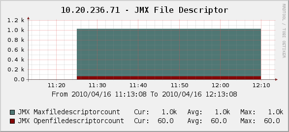
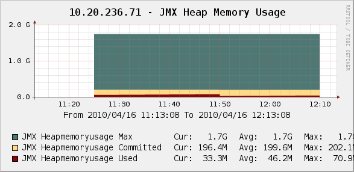
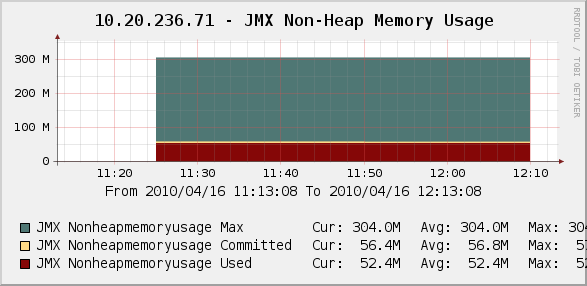

.. _cacti_jmx_templates:

Percona JMX Monitoring Template for Cacti
=========================================

These templates use ``ss_get_by_ssh.php`` to connect to a server via SSH and
extract statistics from the JMX server.

Installation
============

Set up the SSH-based template script. After that is working, you should make the
Java runtime information available through JMX by adding the JMX system
properties when you start the program you want to monitor. For a normal Java
program, you can learn more about this from

`Monitoring and Management Using JMX
<http://java.sun.com/j2se/1.5.0/docs/guide/management/agent.html>`_.  If you are
using Tomcat, you can read `Monitoring and Managing Tomcat
<http://tomcat.apache.org/tomcat-6.0-doc/monitoring.html>`_. A simple example of
how to start Notepad.jar with JMX instrumentation follows::

   $ java -jar -Dcom.sun.management.jmxremote \
   -Dcom.sun.management.jmxremote.port=9012 \
   -Dcom.sun.management.jmxremote.ssl=false \
   -Dcom.sun.magement.jmxremote.authenticate=false \
   /path/to/Notepad.jar

Now you need to install ``ant`` and the XML file with the JMX definitions. Copy
``misc/jmx-monitor.xml`` to the monitoring user's ``$HOME`` directory on the
server you want to monitor. Then download ``catalina-ant-jmx.jar``, which is
part of `Tomcat <http://tomcat.apache.org/download-60.cgi>`_, to the
``$HOME/.ant/lib`` directory.

Before you test the Cacti script's functionality, test that the instrumentation
is available to JMX. Run the following command on the host you want to monitor,
from the Cacti user's home directory.  Replace any values as needed::

   ant -Djmx.server.port=9012 -e -q -f jmx-monitor.xml

Now on the Cacti host, test a command similar to the following, replacing any
values necessary with ones appropriate for your environment::

   # su - cacti -c 'env -i php /var/www/cacti/scripts/ss_get_by_ssh.php --type jmx --host 127.0.0.1 --items j4,j5'

Sample Graphs
=============

The following sample graphs demonstrate how the data is presented.

   The file descriptors used by the JMX process.

   The heap memory usage used by the JMX process.

   The non-heap memory usage used by the JMX process.
