.. _cacti_linux_templates:

Percona Linux Monitoring Template for Cacti
===========================================

These templates use ``ss_get_by_ssh.php`` to connect to a server via SSH and
extract standard metrics such as memory usage, number of users, and CPU usage.
This is a good substitute for the standard kinds of system metrics one might
graph via SNMP, when SNMP is not available or not desired.

Installation
------------

Once the SSH connection is working, no special installation is
necessary for most of the graphs.

*The disk I/O graphs are special*.  Each graph requires that you specify the
device you want to graph.  For ``/dev/sda``, for example, you should specify
``sda``.  Do not create the graphs through the normal host template method.
Rather, add the graphs to the host manually, one at a time, by clicking "Create
Graph" and selecting the desired graph template.  Edit not only the device name
in the command line, but the name of the graph and data input.  Append the name
of the device.  This will make the items visually distinctive.

See the following screenshot for an example:

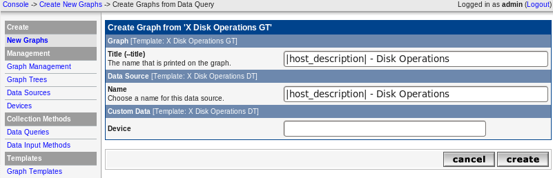

You should append ``sda`` in every textbox shown in that screenshot, if you want
to monitor ``/dev/sda``.

However, for "Disk Space" graph you have to specify the volume.

**Device** is a block device name as it appears in ``/proc/diskstats`` and not
always seeing from ``df`` output especially when logical volumes are in use,
e.g. ``sda3``, ``xvda1``, ``cciss/c0d0p1``. It also can be verified from
``lsblk`` output. If ``lsblk`` is not available use ``pvdisplay`` from lvm2
package.

**Volume** is a filesystem absolute path as it appears under the first column of
``df`` output, e.g. ``/dev/sda3``, ``/dev/cciss/c0d0p1``,
``/dev/mapper/vglocal01-mysql00``.

Example with logical volumes:

.. code-block:: bash

   [root@localhost ~]# df -h
   Filesystem            Size  Used Avail Use% Mounted on
   /dev/mapper/vglocal02-root00
                         271G  5.5G  252G   3% /
   tmpfs                 127G     0  127G   0% /dev/shm
   /dev/sda1             243M   32M  199M  14% /boot
   /dev/mapper/vglocal02-tmp00
                         2.0G   68M  1.9G   4% /tmp
   /dev/mapper/vglocal01-mysql00
                         700G  198G  503G  29% /mnt/mysql-fs
   [root@localhost ~]# lsblk
   NAME                              MAJ:MIN RM   SIZE RO TYPE MOUNTPOINT
   sda                                 8:0    0 278.9G  0 disk
   |-sda1                              8:1    0   250M  0 part /boot
   `-sda2                              8:2    0 278.6G  0 part
     |-vglocal02-swap00 (dm-0)       253:0    0     2G  0 lvm  [SWAP]
     |-vglocal02-root00 (dm-1)       253:1    0 274.6G  0 lvm  /
     `-vglocal02-tmp00 (dm-3)        253:3    0     2G  0 lvm  /tmp
   sdb                                 8:16   0   744G  0 disk
   `-sdb1                              8:17   0   744G  0 part
     `-vglocal01-mysql00 (dm-2)      253:2    0   700G  0 lvm  /mnt/mysql-fs

Device is ``sdb1`` and volume is ``/dev/mapper/vglocal01-mysql00`` in this
example, if you want to monitor /mnt/mysql-fs.

Sample Graphs
-------------

The following sample graphs demonstrate how the data is presented.

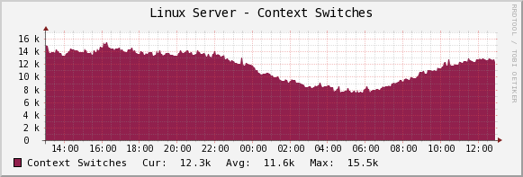

The number of context switches performed by the server.

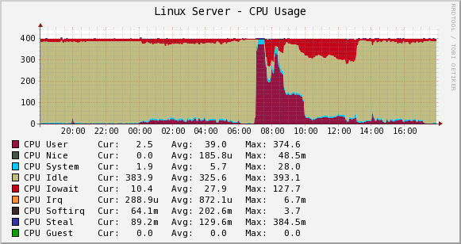

The CPU usage. The example shows a server having 1 processor with
2 cores, 4 threads, i.e. 4 virtual CPUs. The values will increase by 100
with each added virtual CPU.

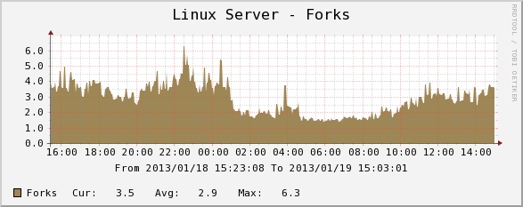

The number of new processes created by the system.

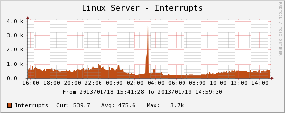

The interrupts the system handles.

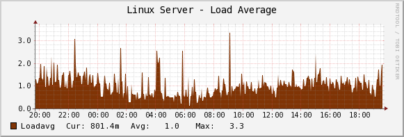

The system load average.

If you're used to Cacti's standard load average graph, you might think this
one has less information.  That is not true; the standard graph that comes
with Cacti simply shows the same information averaged over three time
intervals, which is redundant.  RRDTool is natively capable of doing that.

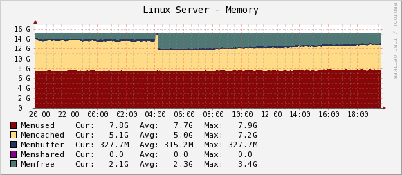

The system's memory usage.

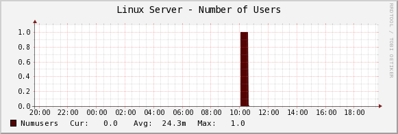

The number of users that were logged into the system, as reported by the "w" command.

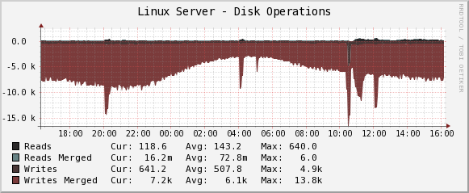

The number of read and write operations completed, and how many reads and writes were merged.

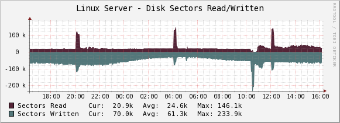

The number of disk sectors read and written.

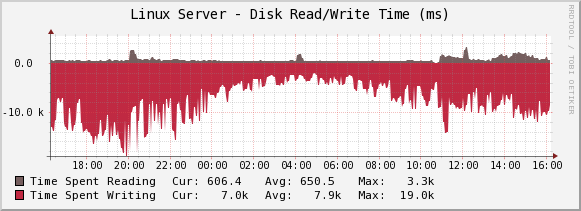

The amount of time spent reading and writing.

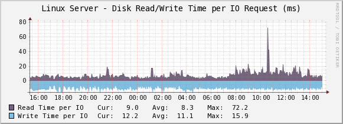

The amount of time spent reading and writing per 1 IO request.

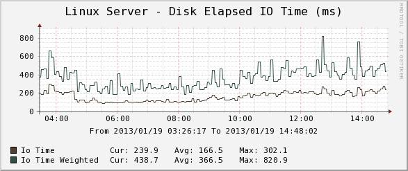

The disk utilization.
This graph shows how much time was spent in disk I/O overall (busy time), and
how much weighted time was spent doing disk I/O. The latter is a useful
indication of I/O backlog. The weighted time is the number of requests
multiplied by the busy time, so if there are 5 requests that take 1 second,
it is 5 seconds. (If they all happen at the same time, the busy time is only
1 second.)

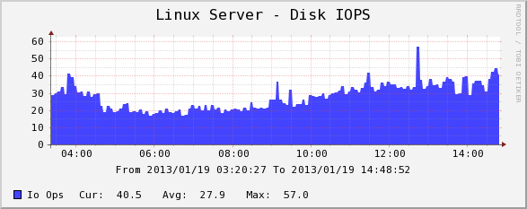

The number of disk IO operations per second. Actually, this is a sum of reads + writes.

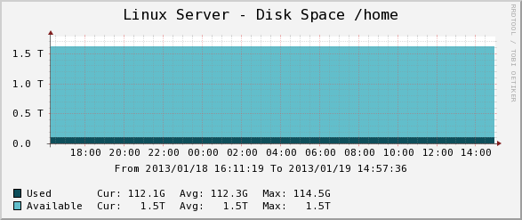

The disk space for the volume.

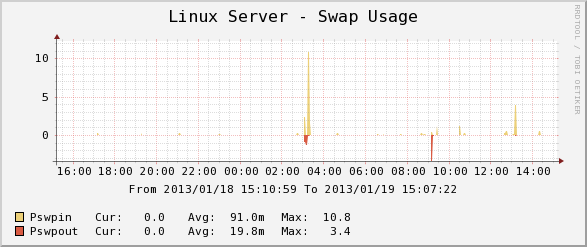

The swap usage of the system.

.. image:: images/linux_network_traffic.png

The network traffic for the adapter in bits/sec.

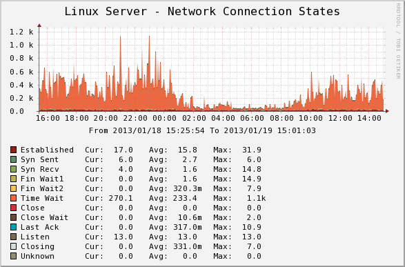

The network connection states for the adapter.

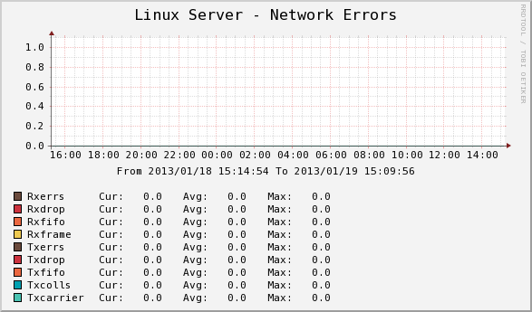

The network errors for the adapter.
