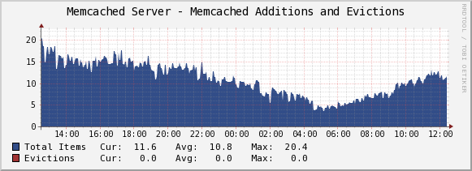
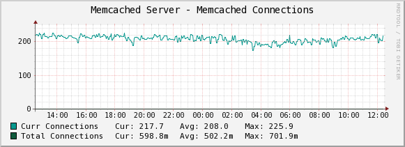
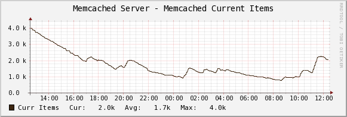
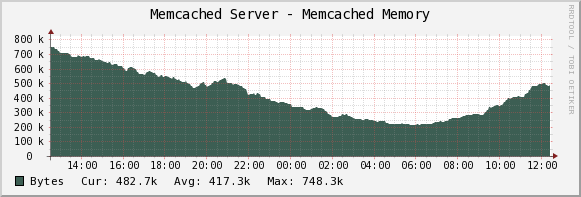
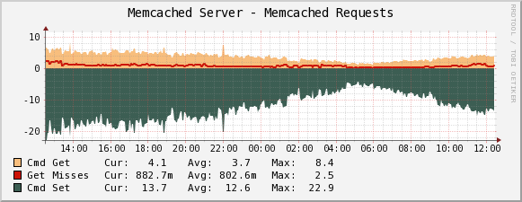
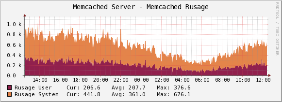
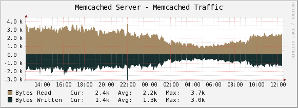

.. _cacti_memcached_templates:

Percona Apache Monitoring Template for Memcached
================================================

These templates use ``ss_get_by_ssh.php`` to connect to a server via SSH and
extract statistics from the memcached server running there, by executing the
``nc`` (netcat) program with the command "STAT".  This means you don't need any
memcached APIs installed.  Standard Unix command-line tools are all you need.

Installation
------------

Once the SSH connection is working, you need to test the memcached
function.  You may need to change some of the example values below, such as the
cacti username and the hostname you're connecting to::

   # su - cacti -c 'env -i php /var/www/cacti/scripts/ss_get_by_ssh.php --type memcached --host 127.0.0.1 --items h6,h7'

You need ``nc`` on the server.  Some versions of ``nc`` accept different
command-line options.  You can change the options used by configuring the PHP
script.  If you don't want to do this for some reason, then you can install a
version of ``nc`` that conforms to the expectations coded in the script's
default configuration instead.  On Debian/Ubuntu, ``netcat-openbsd`` does not
work, so you need the ``netcat-traditional`` package, and you need to switch to
``/bin/nc.traditional`` with the following command::

   # update-alternatives --config nc

Sample Graphs
-------------

The following sample graphs demonstrate how the data is presented.

Shows how many items were added and evicted.

Shows how many connections have been made.

Shows how many items are stored in the server.

Shows how much memory the server is using.

Shows how many gets and sets have happened, as well as how many of the gets were misses (there was no item in the cache).

Shows the resource usage statistics reported by memcached, in system and user CPU time.

Shows the network traffic in and out of the memcached server.
