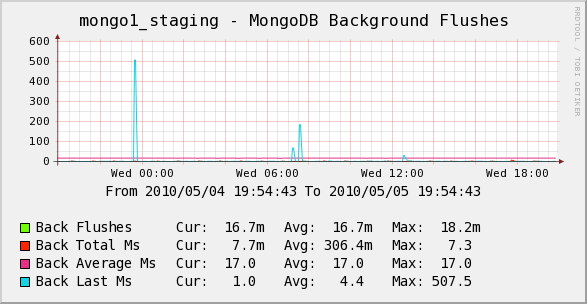
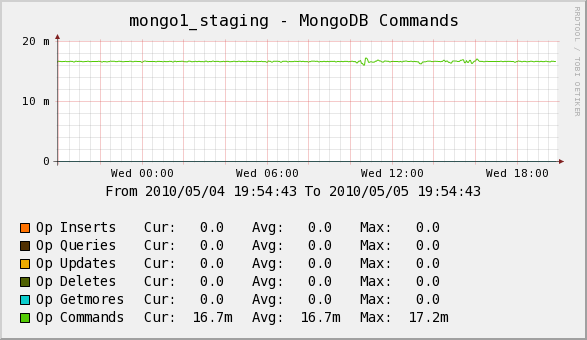
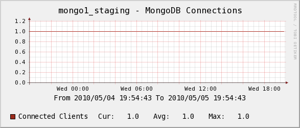
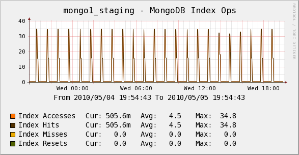
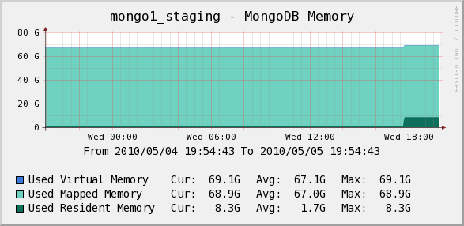

.. _cacti_mongodb_templates:

Percona MongoDB Monitoring Template for Cacti
=============================================

These templates use ``ss_get_by_ssh.php`` to connect to a server via SSH and
extract statistics from the MongoDB server running there, by executing the
``serverStatus`` admin command from the MongoDB shell. This means that the
``mongo`` CLI needs to be in ``$PATH`` and you must be running version 1.2 or
newer of MongoDB.

Installation
------------

Once the SSH connection is working, confirm that you can login to
MongoDB from with the "mongo" cli tool. From this tool, confirm that the
``serverStatus`` command is present by running::

   db._adminCommand({serverStatus : 1});

This should produce quite a bit of output. With all of this confirmed, test one
of your hosts with the command below. You may need to change some of the example
values below, such as the cacti username and the hostname you're connecting to::

   su - cacti -c 'env -i php /var/www/cacti/scripts/ss_get_by_ssh.php --type mongodb --host 127.0.0.1 --items jc,jd'

Sample Graphs
-------------

The following sample graphs demonstrate how the data is presented.

Background flushes

Commands

Connections

Index Operations

Memory
