.. _cacti_mysql_templates:

Percona MySQL Monitoring Template for Cacti
===========================================

This page gives installation instructions specific to the MySQL graph templates,
shows examples of graphs in the MySQL template collection, and shows what they
do.  You might want to look at
http://dev.mysql.com/doc/refman/5.1/en/server-status-variables.html to learn the
meaning of the status variables contained in the graphs.

Installation Notes
------------------

The MySQL templates work by executing a PHP script that gathers information from
MySQL servers and returns it to Cacti.  The script makes an ordinary MySQL
connection to gather its input.

It is highly recommended that you use the same MySQL username and password for
all servers you want to graph, to ease the installation and configuration.  If
you don't, you will need to customize your templates to accommodate your
installation.  See below for detailed information on the privileges.

The script requires that you be able to connect to MySQL from your Cacti server.
You can test this with the ``mysql`` command-line program.  Debugging MySQL
connection problems is beyond the scope of this documentation; refer to the
MySQL manual if you have trouble.

To install,

* Create a MySQL user with the SUPER and PROCESS privileges on each server you want to monitor.  Assuming you use "cacti" and "s3cret" as your username and password, execute the following command on each server: ``GRANT SUPER, PROCESS ON *.* TO 'cacti'@'%' IDENTIFIED BY "s3cret";``
* If you want to monitor replication with ``pt-heartbeat`` from Percona Toolkit (recommended), you must grant SELECT on the heartbeat table also.  Assuming the ``pt-heartbeat`` table is ``percona.heartbeat``, execute ``GRANT SELECT ON percona.heartbeat TO 'cacti'@'%';``
* Copy ss_get_mysql_stats.php into your Cacti installation's scripts/ directory.
* All other steps are the same as mentioned in in installation document.

If you want to specify a different MySQL port for various servers, see
the instructions on how to accept input in each data source.

.. _mysql-templates-user-privileges:

User Privileges
---------------

The suggested user privileges mentioned above are sufficient for the common
case.  In some cases you might not want or have such access.  The following list
explains the queries that the data-gathering script executes, the functionality,
and how to disable if it's unwanted:

``SHOW /*!50002 GLOBAL */ STATUS``
   This query requires no special privileges and is necessary for core functionality.
``SHOW VARIABLES``
   This query requires no special privileges and is necessary for core functionality.
``SHOW ENGINES``
   This query requires no special privileges and is necessary for core functionality.
``SHOW SLAVE STATUS``
   This query requires either SUPER or REPLICATION CLIENT.  It is necessary for tracking replication lag on replication slaves, which is enabled by default.  To disable, edit the ``$chk_options`` array in the configuration.  Alternatively, use ``pt-heartbeat`` and grant SELECT on the heartbeat table.  If disabled, parts of the the MySQL Replication Status and MySQL Binary/Relay logs graphs will be empty.
``SHOW MASTER LOGS``
   This query is used to count up the size of binary logs.  It requires the SUPER privilege.  If disabled in the ``$chk_options`` array, then part of the MySQL Binary/Relay logs graph will be empty.
``SHOW PROCESSLIST``
   This query requires the PROCESS privilege to generate the MySQL Processlist graph.  You can disable this query by editing the ``$chk_options`` array in the configuration.
``SHOW /*!50000 ENGINE*/ INNODB STATUS``
   This query requires the SUPER privilege in MySQL 5.1.23 and older versions.  It is required for all of the InnoDB graphs.  You can disable this query by editing the ``$chk_options`` array in the configuration.  In MySQL 5.1.24 and greater, the required privilege is PROCESS, not SUPER.

If you disable significant portions of the functionality, such as the InnoDB
graphs, then you might want to edit the Host Template to remove unwanted graphs.

Sample Graphs
-------------

The following sample graphs demonstrate how the data is presented.

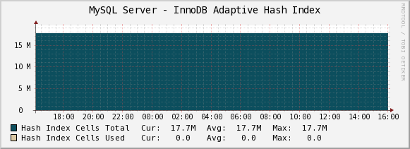

The InnoDB Adaptive Hash Index graph shows the hash index's cells total and cells used.  There isn't
really anything actionable about this graph: the adaptive hash index isn't
designed to be user-tunable, although you can disable it.  However, should
something go wrong with performance, this graph might provide diagnostic
information.

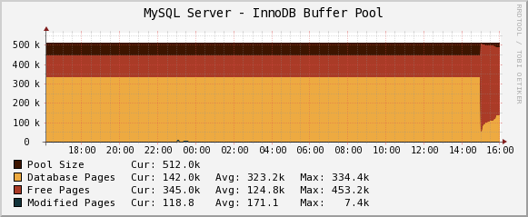

The InnoDB Buffer Pool graph shows the current status of the InnoDB buffer pool: the size, free
pages, used (database) pages, and dirty (modified) pages.  If too much of the
buffer pool fills with dirty pages and InnoDB starts to flush aggressively to
reduce that number, you could see cyclical behavior.  This might be correlated
with intense disk activity and/or periods of reduced throughput.  Recent
versions of the InnoDB plugin, Percona Server, and Percona XtraDB have various
solutions for this problem, should you experience it.

The example graph shows what happens when InnoDB restarts: the buffer pool
empties and then fills again.

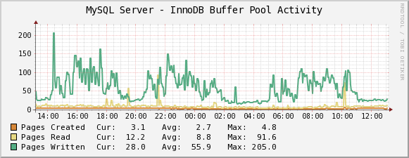

The InnoDB Buffer Pool Activity graph shows activity inside the buffer pool: pages created, read, and
written.  You can consider it roughly equivalent to the Handler graphs.  If you
see a sudden change in the graph, you should try to trace it to some change in
your application.

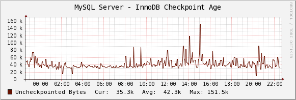

The InnoDB Checkpoint Age graph shows the InnoDB checkpoint age, which is the same thing as the
number of uncheckpointed bytes, and thus the amount of log that will need to be
scanned to perform recovery if there's a crash.  If the uncheckpointed bytes
begin to approach the combined size of the InnoDB log files, your system might
need larger log files.  In addition, a lot of un-checkpointed data might
indicate that you'll have a long and painful recovery if there's a crash.  If
you are writing a tremendous amount of data to the log files, and thus need
large log files for performance, you might consider the enhancements in Percona
Server.

.. image:: images/mysql_innodb_current_lock_waits.png

The InnoDB Current Lock Waits graph shows the total number of seconds that InnoDB transactions have been
waiting for locks.  This is related to the InnoDB Active/Locked Transactions graph,
except that it's the sum of the lock wait time.  You might have only one
transaction in LOCK WAIT status, but it might be waiting a very long time if
``innodb_lock_wait_timeout`` is set to a large value.  So if you see a large
value on this graph, you should investigate for LOCK WAIT transactions.

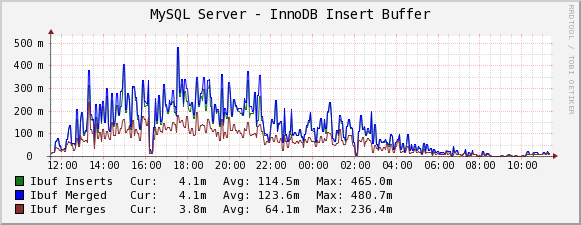

The InnoDB Insert Buffer graph shows information about InnoDB's insert buffer: inserts, merge
operations, and merged records.  This is not generally actionable, because the
insert buffer is not user-configurable in standard MySQL.  However, you can use
it to diagnose certain kinds of performance problems, such as furious disk
activity after you stop the server from processing queries, or during particular
types of queries that force the insert buffer to be merged into the indexes.
(The insert buffer is sort of a delayed way of updating non-unique secondary
indexes.)  If the insert buffer is causing problems, then Percona Server might
help, because it has some configuration parameters for the buffer.

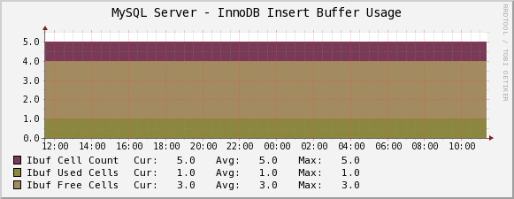

The InnoDB Insert Buffer Usage graph shows the total cells in the insert buffer, and the used and free
cells.  This is diagnostic only, as in the previous graph.  You can use it to
see the buffer usage, and thus correlate with server activity that might be hard
to explain otherwise.

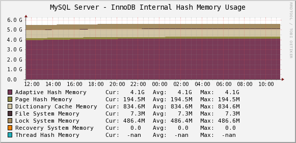

The InnoDB Internal Hash Memory Usage graph shows how much memory InnoDB uses for various internal hash
structures: the adaptive hash index, page hash, dictionary cache, filesystem,
locks, recovery system, and thread hash.  This is available only in Percona
Server, and these structures are generally not configurable.  However, you might
use it to diagnose some kinds of performance problems, such as much greater than
expected memory usage.  In standard InnoDB, the internal data dictionary tends
to consume large amounts of memory when you have many tables, for example.
Percona Server lets you control that with some features that are similar to
MySQL's table cache.

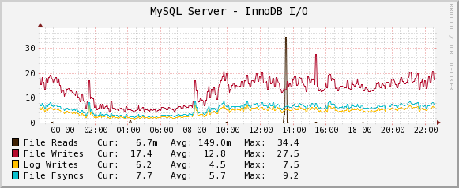

The InnoDB I/O Activity graph shows InnoDB's I/O activity: file reads and writes, log writes, and
fsync() calls.  This might help diagnose the source of I/O activity on the
system.  Some of this can be influenced with InnoDB settings, especially
``innodb_flush_log_at_trx_commit``.

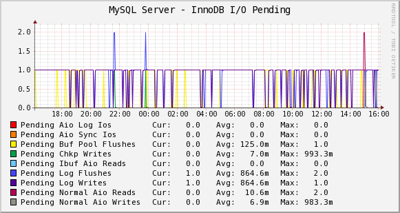

The InnoDB I/O Pending graph shows InnoDB's pending synchronous and asynchronous I/O operations in
various parts of the engine.  Pending I/O is not ideal; ideally you'd like
InnoDB's background thread(s) to keep up with writes, and you'd like the buffer
pool large enough that reads are not an issue.  If you see a lot of pending I/O,
you might need more RAM, a bigger buffer pool (or use O_DIRECT to avoid
double-buffering), or a faster disk subsystem.

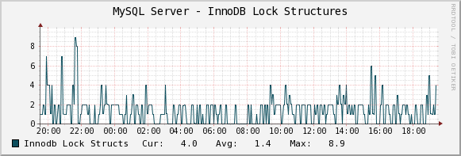

The InnoDB Lock Structures graph shows how many lock structures InnoDB has internally.  This should
correlate roughly to the number of row locks transactions are currently holding,
and might be useful to help diagnose increased lock contention.  There is no
hard rule about what's a good or bad number of locks, but in case many
transactions are waiting for locks, obviously fewer is better.

The data comes from lines in SHOW INNODB STATUS such as the following::

         # 23 lock struct(s), heap size 3024, undo log entries 27
         # LOCK WAIT 12 lock struct(s), heap size 3024, undo log entries 5
         # LOCK WAIT 2 lock struct(s), heap size 368

It is the sum of all of the ``N lock struct(s)`` values.

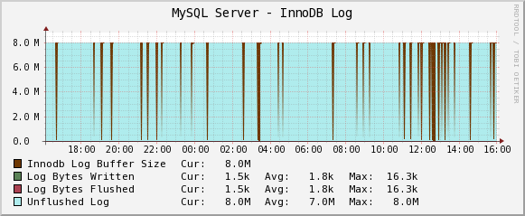

The InnoDB Log Activity graph shows InnoDB log activity: the log buffer size, bytes written,
flushed, and unflushed.  If transactions need to write to the log buffer and
it's either not big enough or is currently being flushed, they'll stall.

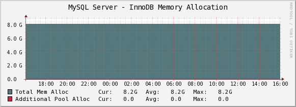

The InnoDB Memory Allocation graph shows InnoDB's total memory allocation, and how much of that is in
the additional pool (as opposed to the buffer pool).  If a lot of memory is in
the additional memory pool, you might suspect problems with the internal data
dictionary cache; see above for more on this.  Unfortunately, in standard InnoDB
it's a bit hard to know where the memory really goes.

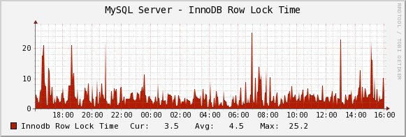

The InnoDB Row Lock Time graph shows the amount of time, in milliseconds, that InnoDB has waited to
grant row locks.  This comes from the ``Innodb_row_lock_time`` status variable.

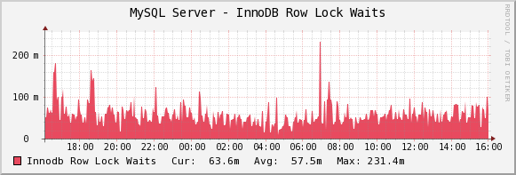

The InnoDB Row Lock Waits graph shows the number of times that InnoDB has waited to grant row locks.
This comes from the ``Innodb_row_lock_waits`` status variable.

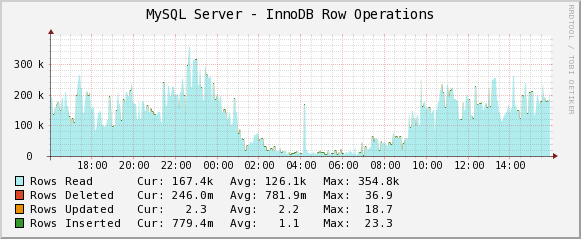

The InnoDB Row Operations graph shows row operations InnoDB has performed: reads, deletes, inserts,
and updates.  These should be roughly equivalent to Handler statistics, with the
exception that they can show internal operations not reflected in the Handler
statistics.  These might include foreign key operations, for example.

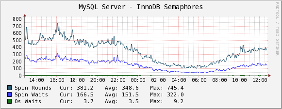

The InnoDB Semaphores graph shows information on InnoDB semaphore activity: the number of spin
rounds, spin waits, and OS waits.  You might see these graphs spike during times
of high concurrency or contention.  These graphs basically indicate different
types of activity involved in obtaining row locks or mutexes, which are causes
of poor scaling in some cases.

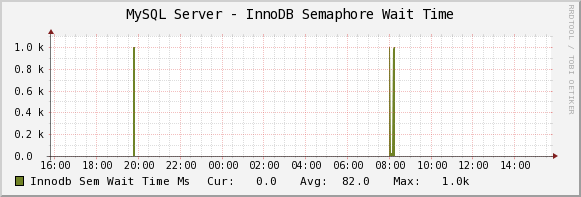

The InnoDB Semaphore Wait Time graph shows the amount of time, in milliseconds,
that threads have waited for the semaphore.

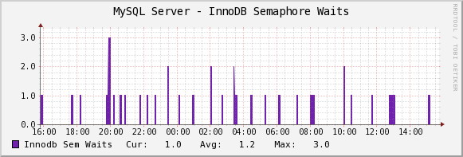

The InnoDB Semaphore Waits graph shows the number of times that threads have
waited for the semaphore.

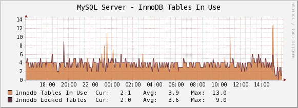

The InnoDB Tables In Use graph shows how many tables InnoDB has in use and how many are locked.  If
there are spikes in these graphs, you'll probably also see spikes in LOCK WAIT
and other signs of contention amongst queries.

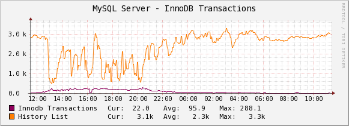

The InnoDB Transactions graph shows information about transactions within InnoDB.

* How changes the internal transaction counter (Trx id counter).
* The length of the history list shows how old the oldest unpurged transaction is.  If this grows large, you might have transactions that are staying open a very long time.  This means InnoDB can't purge old row versions.  It will get bloated and slow as a result.  Commit your transactions as quickly as you can.

.. image:: images/mysql_innodb_transactions_activelocked.png

The InnoDB Active/Locked Transactions graph shows InnoDB transaction counts:

* An active transaction is a transaction that's currently open.  It's possible for transactions to be in "not started" status, which really means that this connection to MySQL doesn't actually have a transaction open.  A transaction is active between BEGIN and COMMIT.  It's also active whilst a query is running, although it might commit immediately due to auto-commit, if applicable.  This graph really just shows how much transactional activity is happening on the database.
* A locked transaction is in LOCK WAIT status.  This usually means it's waiting for a row lock, but in some cases could be a table lock or an auto-increment lock.  If you start to see lock waits, you need to check SHOW INNODB STATUS and search for the string "LOCK WAIT" to examine what's waiting.  Lock waits can come from several sources, including too much contention on busy tables, queries accessing data through scans on different indexes, or bad query patterns such as SELECT .. FOR UPDATE.
* The current transactions are all transactions, no matter what status (ACTIVE, LOCK WAIT, not started, etc).
* The number of read views open shows how many transactions have a consistent snapshot of the database's contents, which is achieved by MVCC.

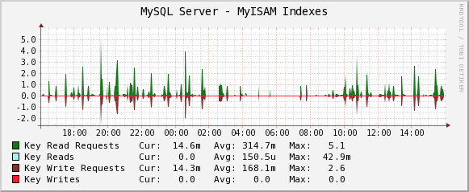

The MyISAM Indexes graph shows information about how many logical and physical reads and
writes took place to MyISAM indexes.  Probably the most important one is the
physical reads.  The ratio between logical and physical reads is not very useful
to monitor. Instead, you should look at the absolute number of physical reads
per second, and compare it to what your disks are capable of.  (RRDTool
normalizes everything to units of seconds, so this graph's absolute value is the
number you need.)

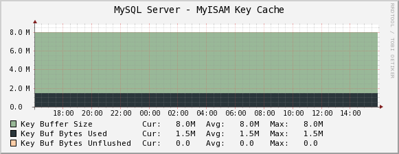

The MyISAM Key Cache graph shows the size of the key buffer, how much of it is used, and how
much is unflushed.  Memory that isn't used might not really be allocated; the
key buffer isn't allocated to its full size.

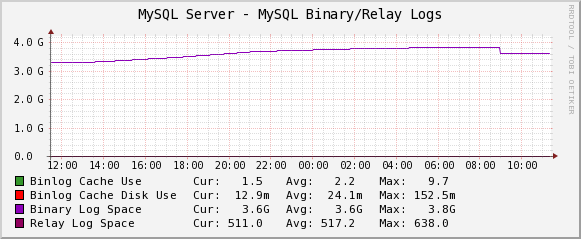

The MySQL Binary/Relay logs graph shows information about the space used by the server binary and relay
logs.  The variations in the sizes are when the logs are purged, probably due to
``expire_logs_days`` being set.  If this suddenly grows large, look for problems
in purging, which might be caused by a configuration change, or by someone
manually deleting a file and causing the automatic purge to stop working.

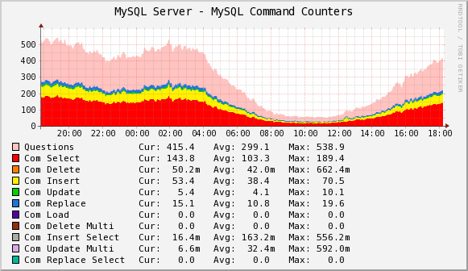

The MySQL Command Counters graph shows counters for various MySQL commands.  These are derived from
the ``Com_`` counters from ``SHOW STATUS``.  If there is a change in the graph,
it indicates that something changed in the application.

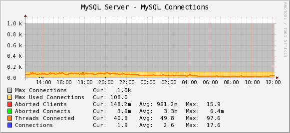

The MySQL Connections graph shows information about the connection parameters and counters inside
MySQL: connections permitted, connections used, connections aborted, clients
aborted, current connections, and connections created.  Probably the most
interesting are the aborted clients and connections, which might indicate a
malfunctioning application that disconnects ungracefully, an idle connection
timing out, network problems, bad authentication attempts, or similar.

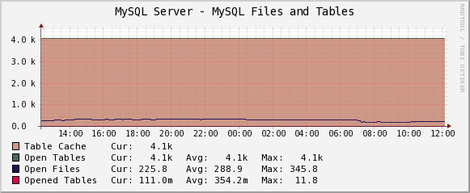

The MySQL Files and Tables graph shows status of MySQL's table cache and file handles: the size of the
cache, and how many open files and tables there are.  This graph is not likely
to contain much information in the normal course of events.

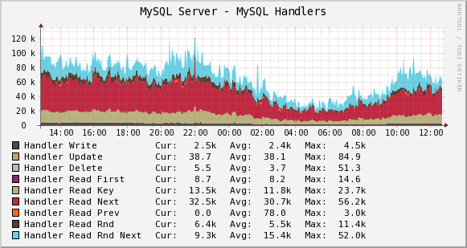

The MySQL Handlers graph shows the various Handler counters, which record how many operations
MySQL has done through the storage engine API.  Changes in indexing will
probably show up clearly here: a query that used to do a table scan but now has
a good index to use will cause different Handler calls to be used, for example.
If you see sudden changes, it probably correlates with schema changes or a
different mixture of queries.  If you see a large spike of ``Handler_read_rnd_next``,
it probably means something was doing a lot of table scans.

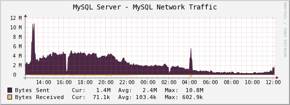

The MySQL Network Traffic graph shows network traffic to and from the MySQL Server, in bytes.

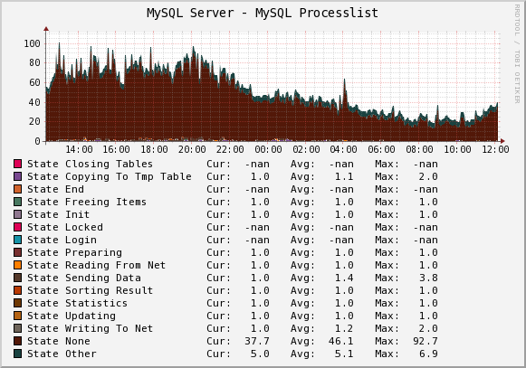

The MySQL Processlist shows the number (count) of queries from SHOW PROCESSLIST
in given statuses.  Some of the statuses are lumped together into the "other"
category.  This is a "scoreboard" type of graph.  In most cases, you
should see mostly Other, or a few of the statuses like "Sending data".  Queries
in Locked status are the hallmark of a lot of MyISAM table locking.  Any mixture
of statuses is possible, and you should investigate sudden and systemic changes.

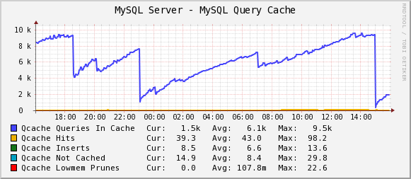

The MySQL Query Cache graph shows information about the query cache inside MySQL: the number of
queries in the cache, inserted, queries not cached, queries pruned due to low
memory, and cache hits.

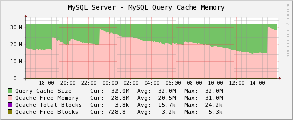

The MySQL Query Cache Memory graph shows information on the query cache's memory usage: total size, free
memory, total blocks and free blocks.  Blocks are not of a uniform size, despite
the name.

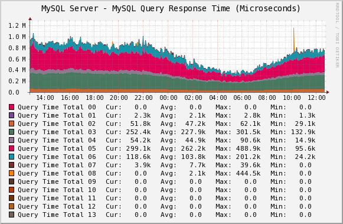

The MySQL Query Response Time (Microseconds) graph displays a histogram of the
`query response time distribution available in Percona Server
<http://www.percona.com/docs/wiki/percona-server:features:response_time_distribution>`_.
Because the time units are user-configurable, exact unit labels are not
displayed; rather, the graph simply shows the values.  There are 14 time units
by default in Percona Server, so there are 13 entries on the graph (the 14th is
non-numeric, so we omit it).

The graph actually displays the amount of response time spent by the server on
queries of various lengths.  See the Percona documentation for more.  The units
are in microseconds on the graph, because RRDtool cannot store floating-point
values.

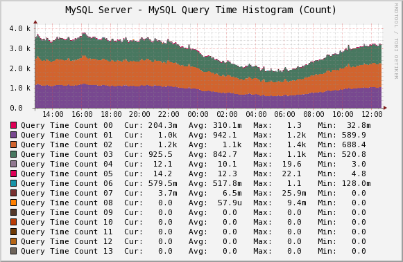

The MySQL Query Time Histogram (Count) graph displays a histogram of the
`query response time distribution available in Percona Server
<http://www.percona.com/docs/wiki/percona-server:features:response_time_distribution>`_.
Because the time units are user-configurable, exact unit labels are not
displayed; rather, the graph simply shows the values.  There are 14 time units
by default in Percona Server, so there are 13 entries on the graph (the 14th is
non-numeric, so we omit it).

The graph displays the number of queries that fell into each time division.  See the Percona documentation for more.

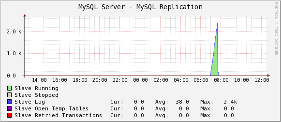

The MySQL Replication Status graph displays the status of the replication thread.  There are two ways to measure the replication delay:

* By looking at SHOW SLAVE STATUS's Seconds_behind_master column, which is shown as Secs Behind Master
* By looking at a heartbeat table such as those supported by the ``pt-heartbeat`` tool in Percona Toolkit. You must configure the ``ss_get_mysql_stats.php`` file to do this.

When replication is running, there is an AREA of the same size as the
replication delay, colored green.  When it's stopped, there's an AREA of the
same size as the replication delay, colored red.  What this means is that you'll
see a graph of replication delay, colored in with the appropriate color (green
or red) to indicate whether replication was stopped at that moment.  If
replication isn't delayed, you won't see any green or red.  If you're using
Seconds_behind_master instead of ``pt-heartbeat`` to measure delay, it's
impossible to measure delay when the slave is stopped, so you won't see any red.
This is one of the reasons Seconds_behind_master from SHOW SLAVE STATUS is
not as useful as ``pt-heartbeat``.

The graph also shows open temporary tables and retried transactions.

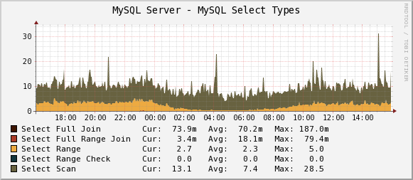

The MySQL Select Types graph shows information on how many of each type of select the MySQL server
has performed: full join, full range join, range, range check, and scan.  Like
the Handler graphs, these show different types of execution plans, so any
changes should be investigated.  You should strive to have zero Select_full_join
queries!

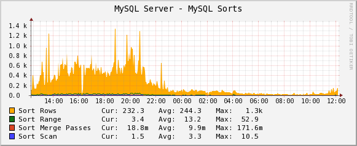

The MySQL Sorts graph shows information about MySQL sort operations: rows sorted, merge
passes, and number of sorts triggered by range and scan queries.  It is easy to
over-analyze this data.  It is not useful as a way to determine whether the
server configuration needs to be changed.

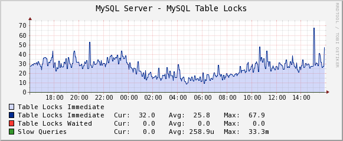

The MySQL Table Locks graph shows information about table-level lock operations inside MySQL:
locks waited, locks granted without waiting, and slow queries.  Locks that have
to wait are generally caused by MyISAM tables.  Even InnoDB tables will cause
locks to be acquired, but they will generally be released right away and no
waiting will occur.

.. image:: images/mysql_mysql_temporary_objects.png

The MySQL Temporary Objects graph shows information about temporary objects created by the MySQL
server: temporary tables, temporary files, and temporary tables created on disk
instead of in memory.  Like sort data, this is easy to over-analyze.  The most
serious one is the temp tables created on disk.  Dealing with these is complex,
but is covered well in the book *High Performance MySQL*.

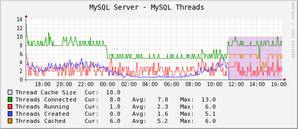

The MySQL Threads graph shows the size of thread cache the server is configured
with and the number of threads of each type.  On this example we can observe that once
thread_cache_size was set to 10, MySQL stopped creating new threads and started using
the cached ones.
 
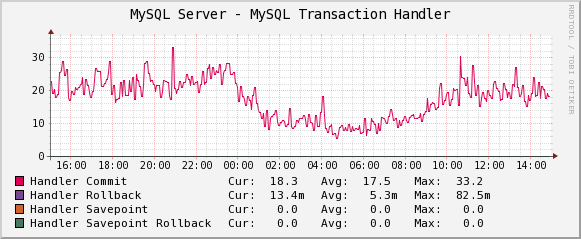

The MySQL Transaction Handler graph shows the transactional operations that took place at the MySQL
server level.
