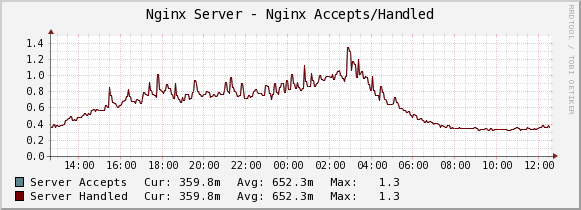
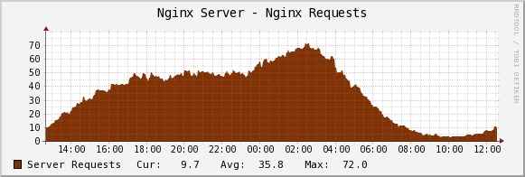

.. _cacti_nginx_templates:

Percona Nginx Monitoring Template for Cacti
===========================================

These templates use ``ss_get_by_ssh.php`` to connect to a server via SSH and
extract statistics from the Nginx server running there, by executing the
``wget`` program with the url ``/server-status``.

Installation
------------

Once the SSH connection is working, configure Nginx to report its
status.  You can add the following to any server context and restart Nginx::

   location /server-status {
      stub_status on;
      allow 127.0.0.1
      # deny all;
   }

If you decide to use a different URL, you'll have to configure that in the
script configuration (covered in the general install guide) or pass a
command-line option (also covered in the general install guide).

Finally, test one of your hosts like this.  You may need to change some of the
example values below, such as the cacti username and the hostname you're
connecting to::

   sudo -u cacti php /usr/share/cacti/scripts/ss_get_by_ssh.php --type nginx --host 127.0.0.1 --items hw,hx

Sample Graphs
-------------

The following sample graphs demonstrate how the data is presented.

The number of connections the server accepted and handled.

The number of requests the Nginx server received.

.. image:: images/nginx_scoreboard.png

The number of connections to the Nginx server in various states.
