.. _cacti_rds_templates:

Percona Amazon RDS Monitoring Template for Cacti
================================================

This page gives installation instructions specific to the RDS graph template,
shows examples of graphs in the RDS template collection, and shows what they
do.

Installation Notes
------------------

This template utilizes the Python script and ``boto`` module (Python interface
to Amazon Web Services) to get various RDS metrics from CloudWatch.

To make the script working, please follow the instructions:

* Install the package: ``yum install python-boto`` or ``apt-get install python-boto``
* Create a config /etc/boto.cfg or ~cacti/.boto with your AWS API credentials.
  See http://code.google.com/p/boto/wiki/BotoConfig

The script ``~cacti/scripts/ss_get_rds_stats.py`` that is run under ``cacti`` user
should have permissions to read the config /etc/boto.cfg or ~cacti/.boto.

For example::

   [root@centos6 ~]# cat ~cacti/.boto 
   [Credentials]
   aws_access_key_id = THISISATESTKEY
   aws_secret_access_key = thisisatestawssecretaccesskey 
   [root@centos6 ~]# chown cacti ~cacti/.boto
   [root@centos6 ~]# chmod 600 ~cacti/.boto

**IMPORTANT:** Ensure the file ``.boto`` is not accessible from Web.
Check out :ref:`Hardening Cacti setup <hardening_cacti_setup>` guide.

Test the script assuming DB instance identifier is ``blackbox``::

   [root@centos6 ~]# sudo -u cacti ~cacti/scripts/ss_get_rds_stats.py --ident=blackbox --metric=CPUUtilization
   gh:6.53

To check RDS details you can run::

   [root@centos6 ~]# sudo -u cacti ~cacti/scripts/ss_get_rds_stats.py --ident=blackbox --print
   ...

Now, you can add a device to the Cacti using Amazon RDS Server template and graph it.

**NOTE**: you need to specify DB instance identifier as ``Hostname`` on adding device page.

Sample Graphs
-------------

The following sample graphs demonstrate how the data is presented.

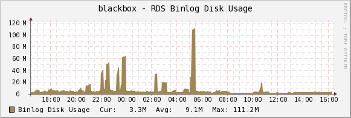

The amount of disk space occupied by binary logs on the master.

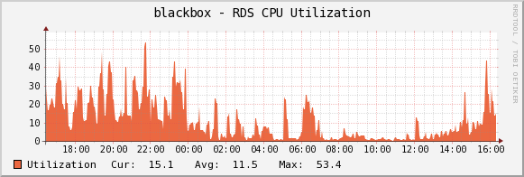

The percentage of CPU utilization.

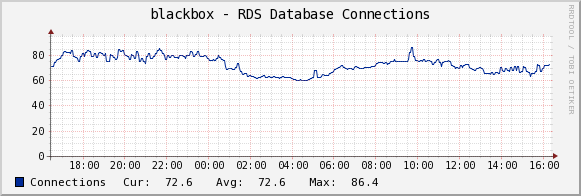

The number of database connections in use.

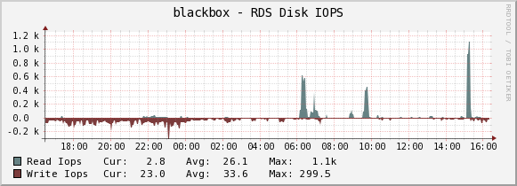

The average number of disk I/O operations per second.

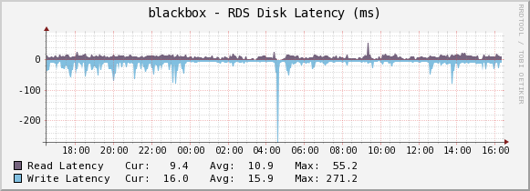

The average amount of time taken per disk I/O operation.

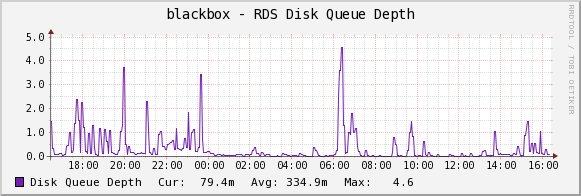

The number of outstanding IOs (read/write requests) waiting to access the disk.

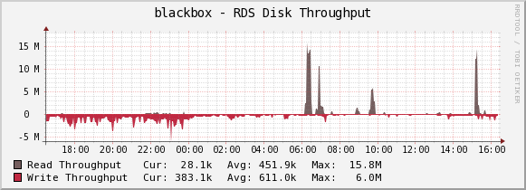

The average number of bytes read from/written to disk per second.

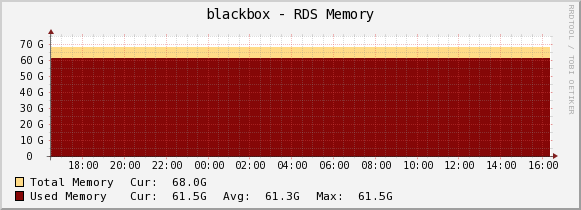

The amount of used random access memory. The total available memory is the value
according to the instance class.
See http://docs.aws.amazon.com/AmazonRDS/latest/UserGuide/Concepts.DBInstanceClass.html 

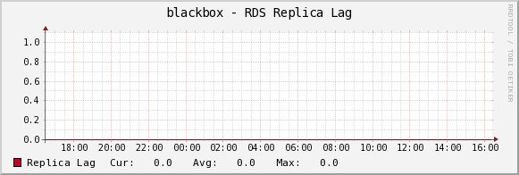

The amount of time a Read Replica DB Instance lags behind the source DB Instance.

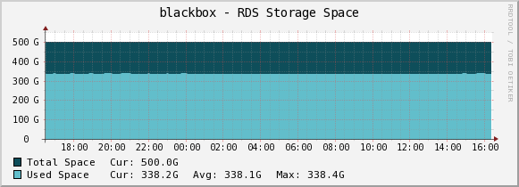

The amount of used storage space.

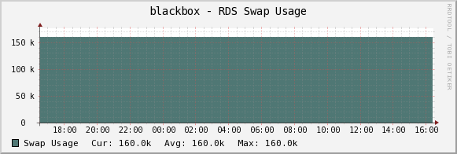

The amount of swap space used on the DB Instance.

