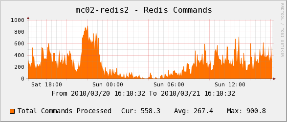
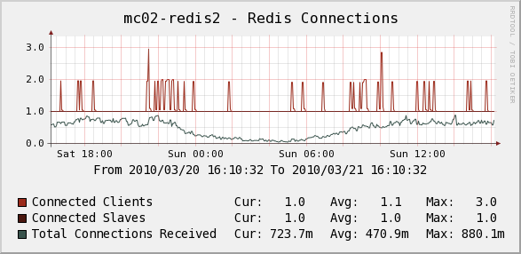
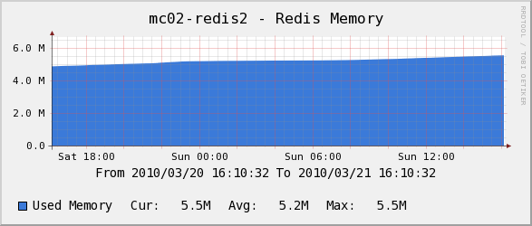
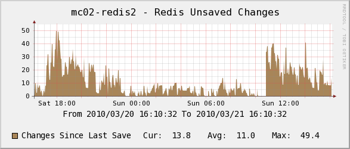

.. _cacti_redis_templates:

Percona Redis Monitoring Template for Cacti
===========================================

These templates use ``ss_get_by_ssh.php`` to connect to a server and extract
statistics from the Redis server with the `INFO command
<http://redis.io/commands/info>`_.  The templates *do not use
SSH*, but connect directly with TCP sockets to gather the information.

Installation
------------

Import the Redis template and apply it to your host, then add the graphs.

You can test one of your hosts like this.  You may need to change some of the
example values below, such as the cacti username and the hostname you're
connecting to::

   sudo -u cacti php /usr/share/cacti/scripts/ss_get_by_ssh.php --type redis --host 127.0.0.1 --items ln,lo

Sample Graphs
-------------

The following sample graphs demonstrate how the data is presented.

Shows commands to the Redis server.

Shows connections to the Redis server.
The top two items are *current* connections at the time the poller sampled
the data; the bottom line, Total Connections, is the number of new
connections created per second during the polling interval.  That's the
important number to watch, and despite the name it should not be equal to the
sum of the first two lines!

Shows memory usage.

Shows unsaved changes.
