.. _cacti_unix_templates:

Percona Linux/Unix Monitoring Template for Cacti
================================================

These templates use ``ss_get_by_ssh.php`` to connect to a server via SSH and
extract standard metrics such as memory usage, number of users, and CPU usage.
This is a good substitute for the standard kinds of system metrics one might
graph via SNMP, when SNMP is not available or not desired.

Installation
============

Once the :ref:`cacti_ssh_setup` is working, no special installation is
necessary for most of the graphs.

*The disk I/O graphs are special*.  Each graph requires that you specify the
device you want to graph.  For ``/dev/sda``, for example, you should specify
``sda``.  Do not create the graphs through the normal host template method.
Rather, add the graphs to the host manually, one at a time, by clicking "Create
Graph" and selecting the desired graph template.  Edit not only the device name
in the command line, but the name of the graph and data input.  Append the name
of the device.  This will make the items visually distinctive.

See the following screenshot for an example:

.. figure:: images/add_unix_disk_graph.png

You should append ``sda`` in every textbox shown in that screenshot, if you want
to monitor ``/dev/sda``.  Use the device name as it appears in ``/proc/diskstats``.

Sample Graphs
=============

The following sample graphs demonstrate how the data is presented.

= Context Switches =

   The number of the number of context switches performed by the server.

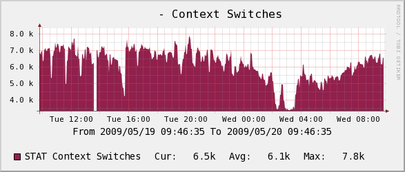

= CPU Usage =

.. figure:: images/proc filesystem.  The example shows a server with two CPUs.  The values will increase by 100 with each added CPU.

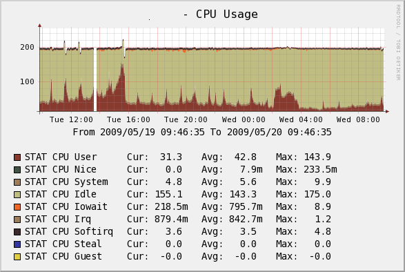

= Forks =

   The number of the number of new processes created by the system.

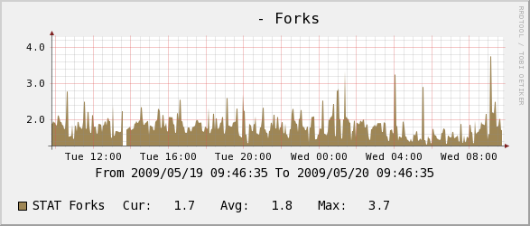

= Interrupts =

   The number of how many interrupts the system handles.

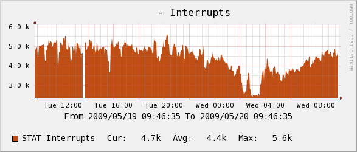

= Load Average =

   The number of system load average.  If you're used to looking at a "pretty" load average graph, you might think this one has less information.  Not so!  The standard graph that comes with Cacti is very silly: it shows the same information averaged over three time intervals, which is useless and redundant.  RRDtool can average the number for you just fine.

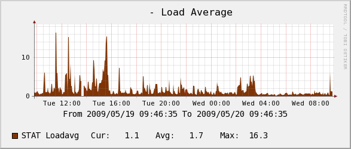

= Memory =

   The number of the system's memory usage, as reported by the "free" command.

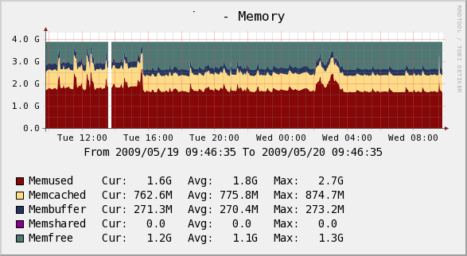

= Number of Users =

   The number of how many users were logged into the system, as reported by the "w" command.

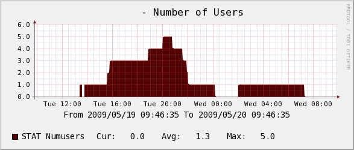

= Disk Operations =

   The number of how many read and write operations were completed, and how many reads and writes were merged.

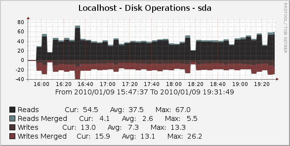

.. figure:: images/Written =

   The number of how many disk sectors were read and written.

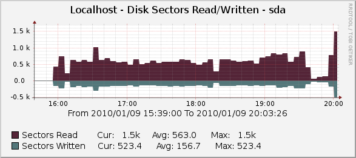

.. figure:: images/Write Time (ms) =

   The number of how much time was spent reading and writing.

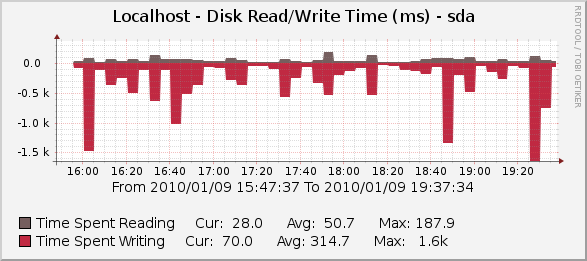

= Disk Elapsed IO Time (ms) =

.. figure:: images/O backlog.  The weighted time is the number of requests multiplied by the busy time, so if there are 5 requests that take 1 second, it is 5 seconds.  (If they all happen at the same time, the busy time is only 1 second.)

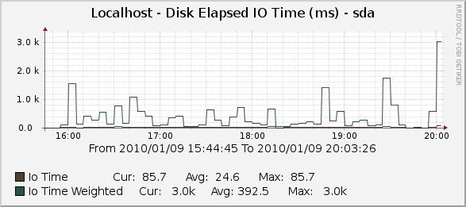
