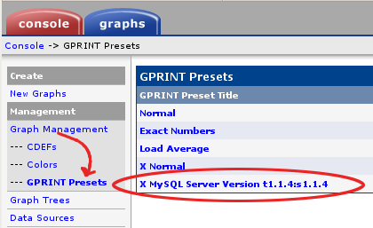

.. _cacti_upgrading_templates:

Upgrading Percona Monitoring Plugins for Cacti
==============================================

Upgrading is normally a simple process.  Before you begin, find the version of
the templates and scripts that is currently installed.  You can find this as a
GPRINT item, as in the following screenshot:

This shows that the MySQL templates installed were generated from version 1.1.4
of the templates, against version 1.1.4 of the PHP script file.

Check the installed scripts for their version::

   # grep ^.version /path/to/ss_get_mysql_stats.php
   $version = "1.1.4";

The changelog explains how to upgrade from each version to the next.
